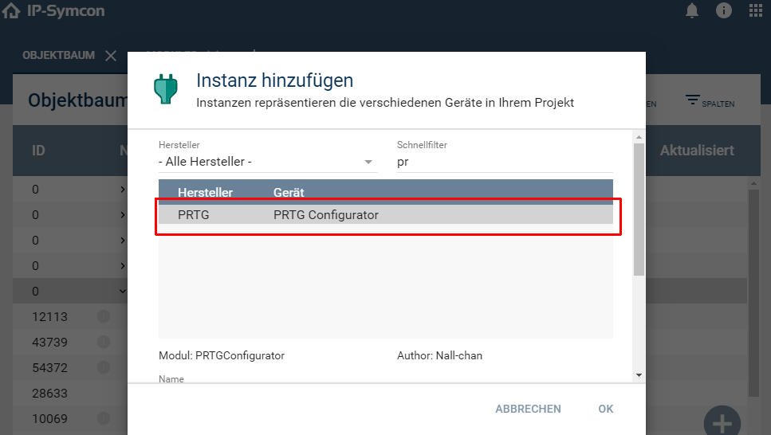
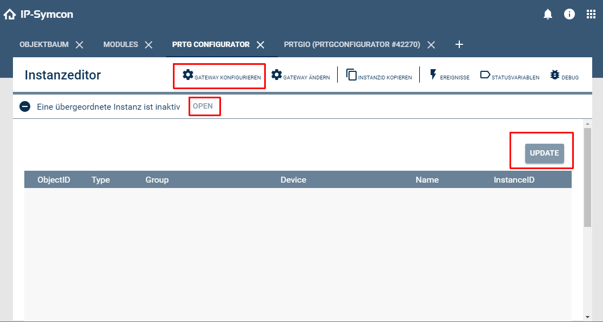

  

# PRTG Konfigurator  
Vereinfacht das Anlegen von verschiedenen PRTG-Instanzen in IPS.  

## Dokumentation

**Inhaltsverzeichnis**

1. [Funktionsumfang](#1-funktionsumfang)  
2. [Voraussetzungen](#2-voraussetzungen)  
3. [Software-Installation](#3-software-installation) 
4. [Einrichten der Instanzen in IP-Symcon](#4-einrichten-der-instanzen-in-ip-symcon)
5. [Statusvariablen und Profile](#5-statusvariablen-und-profile)
6. [WebFront](#6-webfront)
7. [PHP-Befehlsreferenz](#7-php-befehlsreferenz) 
8. [Anhang](#8-anhang)  
9. [Lizenz](#9-lizenz)

## 1. Funktionsumfang

 - Auslesen und darstellen aller in PRTG und IPS bekannten Geräte und Sensoren.  
 - Einfaches Anlegen von neuen Instanzen in IPS.  

## 2. Voraussetzungen

 - IPS 5.0 oder höher  
 - PRTG  

## 3. Software-Installation

 Dieses Modul ist Bestandteil der [IPSPRTG-Library](../).  

**IPS 5.0:**  
   Bei privater Nutzung: Über das 'Module-Control' in IPS folgende URL hinzufügen.  
    `git://github.com/Nall-chan/IPSPRTG.git`  

   **Bei kommerzieller Nutzung (z.B. als Errichter oder Integrator) wenden Sie sich bitte an den Autor.**  

## 4. Einrichten der Instanzen in IP-Symcon

Das Modul ist im Dialog 'Instanz hinzufügen' unter dem Hersteller 'PRTG' zufinden.  
  

Es wird automatisch ein PRTGIO Instanz erzeugt, wenn noch keine vorhanden ist.  
Erscheint im dem sich öffnenden Konfigurationsformular der Hinweis 'Eine übergeordnete Instanz ist inaktiv', so ist zuerst der IO zu konfigurieren.  
  
Dieser kann über die Schaltfläche 'Gateway konfigurieren' erreicht werden.  
Details zur Konfiguration des IO sind der Dokumentation des IO zu entnehmen.

Ist der IO korrekt verbunden, wird beim öffnen des Konfigurator oder nach dem betätigen der Schaltfläche 'Update', folgendender Dialog angezeigt.  
Über das selektieren eines Eintrages in der Tabelle und betätigen des dazugehörigen 'Erstellen' Button,  können einzelne Instanzen in IPS angelegt werden.  
Alternativ können auch alle fehlenden Instanzen auf einmal erstellt werden.  
Erstelle Instanzen werden unterhalb einer Kategorie mit dem Namen des jeweiligen Gerätes erstellt.  
Diese Kategorien werden im logischen Baum direkt im Root erstellt.  
Es kann jedoch eine andere Ursprungskategorie ausgewählt werden.  
Diese Struktur dient dem schellen auffinden der erstellten Instanzen im logischen Baum, anschließend können die Instanzen frfei im Baum verschoben werden.  
  

## 5. Statusvariablen und Profile

Der Konfigurator besitzt keine Statusvariablen und Variablenprofile.  

## 6. WebFront

Der Konfigurator besitzt keine im WebFront darstellbaren Elemente.  

## 7. PHP-Befehlsreferenz

Der Konfigurator besitzt keine Instanz-Funktionen.  

## 8. Anhang

**Changlog:**  

Version 1.31:
 - Darstellungsfehler im Konfigurator beseitigt  
 - Formen nutzen jetzt NumberSpinner mit Suffix anstatt IntervalBox  

Version 1.30:  
 - Fehlerbehandlung Datenaustausch überarbeitet  
 - Konfigurator erstellt Instanz unterhalb von Kategorien mit dem Namen des jeweiligen Gerätes  

Version 1.0:  
 - Erstes offizielles Release  

## 9. Lizenz

  IPS-Modul:  
  [CC BY-NC-SA 4.0](https://creativecommons.org/licenses/by-nc-sa/4.0/)  
