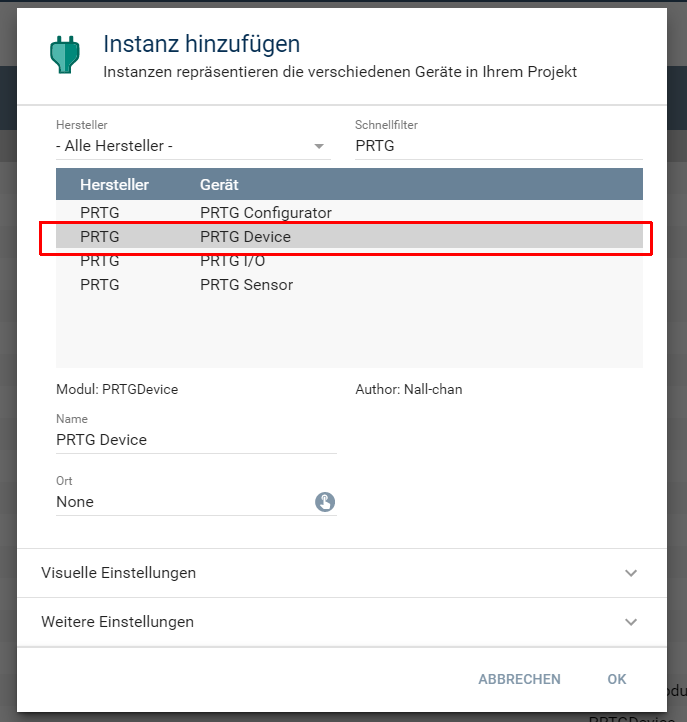
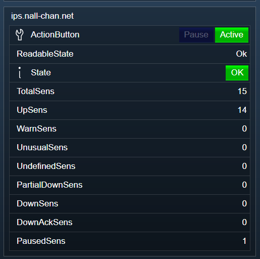

[](https://www.symcon.de/service/dokumentation/entwicklerbereich/sdk-tools/sdk-php/)
[]()
[](https://creativecommons.org/licenses/by-nc-sa/4.0/)  
[](https://www.symcon.de/forum/threads/30857-IP-Symcon-5-1-%28Stable%29-Changelog)
[](https://styleci.io/repos/132882302)  

# PRTG Device
Einbindung eines PRTG-Gerätes in IPS.  

## Dokumentation

**Inhaltsverzeichnis**

1. [Funktionsumfang](#1-funktionsumfang)  
2. [Voraussetzungen](#2-voraussetzungen)  
3. [Software-Installation](#3-software-installation) 
4. [Einrichten der Instanzen in IP-Symcon](#4-einrichten-der-instanzen-in-ip-symcon)
5. [Statusvariablen und Profile](#5-statusvariablen-und-profile)
6. [WebFront](#6-webfront)
7. [PHP-Befehlsreferenz](#7-php-befehlsreferenz) 
8. [Anhang](#8-anhang)  
9. [Lizenz](#9-lizenz)

## 1. Funktionsumfang

 - Empfangen und darstellen des aktuellen Zustände in IPS.  
 - Pausieren und Fortsetzen der Überwachung aus IPS über WebFront und PHP-Scripten.  

## 2. Voraussetzungen

 - IPS 5.1 oder höher  
 - PRTG

## 3. Software-Installation

 Dieses Modul ist Bestandteil der [PRTG-Library](../).  

**IPS 5.1:**  
   Bei privater Nutzung:
     Über den 'Module-Store' in IPS.  
   **Bei kommerzieller Nutzung (z.B. als Errichter oder Integrator) wenden Sie sich bitte an den Autor.**  

## 4. Einrichten der Instanzen in IP-Symcon

Das Anlegen von neuen Instanzen kann komfortabel über den [PRTG Konfigurator:](../PRTGConfigurator/) erfolgen.  

Alternativ ist das Modul im Dialog 'Instanz hinzufügen' unter dem Hersteller 'PRTG' zufinden.  
  

Es wird automatisch ein PRTGIO Instanz erzeugt, wenn noch keine vorhanden ist.  
Erscheint im dem sich öffnenden Konfigurationsformular der Hinweis 'Eine übergeordnete Instanz ist inaktiv', so ist zuerst der IO zu konfigurieren.  
Dieser kann über die Schaltfläche 'Gateway konfigurieren' erreicht werden.  
Details zur Konfiguration des IO sind der Dokumentation des IO zu entnehmen.

Folgende Parameter sind in der Instanz zu konfigurieren:  
  
**Konfigurationsseite:**  

| Eigenschaft         | Typ     | Standardwert | Funktion                                           |
| :-----------------: | :-----: | :----------: | :------------------------------------------------: |
| id                  | integer |              | PRTG ObjektID des Gerätes                          |
| AutoRename          | bool    | true         | Instanz automatisch an den Namen in PRTG anpassen  |
| ShowActionButton    | bool    | true         | Aktionsbutton zum pausieren der Überwachung        |
| ReadableState       | bool    | true         | Status als Klartext in String-Variable             |
| DisplaySensorState  | bool    | true         | Statusvariablen für Zustände des Sensoren          |
| DisplayTotalSensors | bool    | true         | Statusvariablen mit Anzahl aller Sensoren          |
| Interval            | integer | 60           | Abfrageintervall in Sekunden                       |

## 5. Statusvariablen und Profile

Folgende Statusvariablen werden automatisch angelegt.  

| Name                              | Typ     | Ident           | Beschreibung                                                  |
| :-------------------------------: | :-----: | :-------------: | :-----------------------------------------------------------: |
| Status                            | integer | State           | Status des Gerätes                                            |
| Status Klartext                   | string  | ReadableState   | Status des Gerätes als String wie er von PRTG übertragen wird |
| Steuerung                         | integer | ActionButton    | Pause / Resume Button zum Steuern der Überwachung             |
| Sensoren Anzahl                   | integer | TotalSens       | Anzahl aller Sensoren des Gerätes                             |
| Sensoren OK                       | integer | UpSens          | Anzahl der Sensoren im Zustand OK                             |
| Sensoren Warnung                  | integer | WarnSens        | Anzahl der Sensoren im Zustand Warnung                        |
| Sensoren Ungewöhnlich             | integer | UnusualSens     | Anzahl der Sensoren im Zustand Ungewöhnliche Daten            |
| Sensoren Unbekannt                | integer | UndefinedSens   | Anzahl der Sensoren im Zustand Unbekannt                      |
| Sensoren Teilweise Fehlerhaft     | integer | PartialDownSens | Anzahl der Sensoren im Zustand Teilweise Fehlerhaft           |
| Sensoren Fehlerhaft               | integer | DownSens        | Anzahl der Sensoren im Zustand Fehlerhaft                     |
| Sensoren Fehlerhaft (bestätigt)   | integer | DownAckSens     | Anzahl der Sensoren im Zustand Fehlerhaft (bestätigt)         |
| Sensoren Pausiert                 | integer | PausedSens      | Anzahl der Sensoren im Zustand Pausiert                       |

**Profile**:

| Name            | Typ     | verwendet von Statusvariablen |
| :-------------: | :-----: | :---------------------------: |
| PRTG.Sensor     | integer | State                         |
| PRTG.Action     | integer | ActionButton                  |

## 6. WebFront

Die direkte Darstellung und Steuerung im WebFront ist möglich.  
  


## 7. PHP-Befehlsreferenz

```php
bool PRTG_RequestState(integer $InstanzID)
```
Liest den Zustand des Gerätes von PRTG.  
Wurde der Befehl erfolgreich ausgeführt, wird `true` zurück gegeben.  
Im Fehlerfall wird eine Warnung erzeugt und `false`zurück gegeben.  

```php
bool PRTG_SetResume(integer $InstanzID)
```
Setzt die Überwachung des Gerätes in PRTG fort.  
Wurde der Befehl erfolgreich ausgeführt, wird `true` zurück gegeben.  
Im Fehlerfall wird eine Warnung erzeugt und `false`zurück gegeben.  

```php
bool PRTG_SetPause(integer $InstanzID)
```
Pausiert die Überwachung des Gerätes in PRTG.  
Wurde der Befehl erfolgreich ausgeführt, wird `true` zurück gegeben.  
Im Fehlerfall wird eine Warnung erzeugt und `false`zurück gegeben.  

```php
bool PRTG_SetPauseEx(integer $InstanzID, string $Message)
```
Pausiert die Überwachung des Gerätes in PRTG mit einer in '$Message' übergebenen Meldung.  
Wurde der Befehl erfolgreich ausgeführt, wird `true` zurück gegeben.  
Im Fehlerfall wird eine Warnung erzeugt und `false`zurück gegeben.  

```php
bool PRTG_SetPauseDuration(integer $InstanzID, integer $Minutes)
```
Pausiert die Überwachung des Gerätes in PRTG für die in '$Minutes' angegebene Zeit in Minuten.  
Wurde der Befehl erfolgreich ausgeführt, wird `true` zurück gegeben.  
Im Fehlerfall wird eine Warnung erzeugt und `false`zurück gegeben.  

```php
bool PRTG_SetPauseDurationEx(integer $InstanzID, integer $Minutes, string $Message)
```
Pausiert die Überwachung des Gerätes in PRTG mit einer in '$Message' übergebenen Meldung für die in '$Minutes' angegebene Zeit in Minuten.  
Wurde der Befehl erfolgreich ausgeführt, wird `true` zurück gegeben.  
Im Fehlerfall wird eine Warnung erzeugt und `false`zurück gegeben.  

## 8. Anhang

**Changlog:**  

Version 2.00:  
 - Release für IPS 5.1 und den Module-Store   

Version 1.31:
 - Darstellungsfehler im Konfigurator beseitigt  
 - Formen nutzen jetzt NumberSpinner mit Suffix anstatt IntervalBox  

Version 1.30:  
 - Fehlerbehandlung Datenaustausch überarbeitet  

Version 1.0:  
 - Erstes offizielles Release  

## 9. Lizenz

  IPS-Modul:  
  [CC BY-NC-SA 4.0](https://creativecommons.org/licenses/by-nc-sa/4.0/)  
